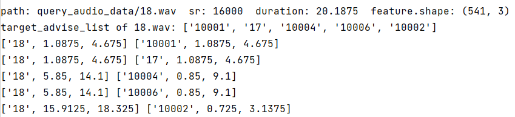

# 音频内容安全审核系统

## 简介
  项目仿照抖音音频内容安全审核链路的主业务流程构建系统，各模块拆分成微服务，使用缓存、限流、异步等方式提高系统的并发能力。音频识别实现声纹、音频重复片段检测的能力。
  包含感知送审、通用能接入机审模型的管道、人审队列、仲裁器、安全结论等模块。

### 服务
技术栈：Java、Thrift、SpringBoot、MyBatis、Kafka、Canal、Zookeeper、Python、TensorFlow 等。

使用Zookeeper进行服务注册与发现，kafka、rpc对系统进行解耦与模块拆分，Guava、Redis进行应用级别限流，多级缓存等，分布式锁等。

- safety-common 通用能力
- safety-api thrift接口
- safety-admin 管理员相关功能
- safety-middle 音频、文件、用户等中台能力
- safety-submit 感知送审服务 监听MQ分发到不同的审核管道中
- safety-pipeline 机审管道，调用风险模型，将数据分发人审队列
- safety-risk 算法模型结果包装成分风险套餐，标准请求与返回格式
- safety-model 算法模型，使用python编写，使用rpc与risk服务交互
- safety-people 人工审核服务
- safety-dispose 仲裁器与安全结论判定服务

### 系统数据流转

### 感知送审

音频服务负责将用户上传音频信息落表加重采样成可识别的音频，通过Canal监听音频数据库的binlog，通过MQ的方式分发分发出去，再由感知送审服务拉取信息。

如：初审链路监听insert消息，复审链路监听update消息等

### 通用审核管道服务

将机器审核流程抽象，使用通用格式接入算法模型，并用可配置的方式来构建机审流程，根据模型结果按照策略通过/分发到人审虚拟队列中；

人审虚拟队列可根据配置，进行分流/聚合数据到实际人审队列，便于解决队列量少、量多、或审核标准一致进行合并的问题，同时处罚回调可根据逻辑队列或实队列路由。

### 算法模型
#### 敏感词识别

在内存中构建一颗字典树，将ASR内容匹配敏感词

音频转ASR使用： https://github.com/nl8590687/ASRT_SpeechRecognition

#### 重复片段检测

主要逻辑：
1. 将音频划分为块，再进行傅里叶变换时，避免丢失时域信息
2. 根据梅尔频谱（或其他划分方式）划分频率范围 对每一块找频率区间幅值最大的那一个频率为关键点
3. 对每一块的关键点 使用hash的方式记录 并以倒排索引的方式存储到数据库中
4. 匹配方式 因为歌曲可能从任何一个点开始与结束 因此从逐点匹配改为匹配区间
5. 将哈希值和音频块建立倒排索引，便于加速查找

参考：https://github.com/anpengjin/query_repeat_part_by_audio

#### 说话人（声音指纹）识别

1. 转化数据 格式、生成梅尔频谱
2. 随机反转、裁剪 进行数据增强，最终得到257*257的短时傅里叶变换的幅度谱
3. 使用经修改的深度残差网络（ResNet50）进行训练
4. 损失函数 使用ArcFace Loss（加性角度间隔损失函数），对特征向量和权重归一化，对θ加上角度间隔m，角度间隔比余弦间隔在对角度的影响更加直接。
5. 声纹对比，模型输出分类及音频特征，通过音频的特征用来比对声纹（求对角余弦值）

参考：https://github.com/yeyupiaoling/VoiceprintRecognition-Tensorflow

### 人审服务

人审由主观判定通过、自见、下架、封禁的方式，改为给音频打标签的方式，再通过后台配置的标签仲裁逻辑，进行仲裁，得出给音频的判定结果。

### 仲裁器

一段音频可能经历过数次审核，每次审核的标准是不同的（如：初审普通标准，复审（当音频达到巨大播放量时）要求会更加严格），因此需要在数次审核之间做取最新/最严格的处罚方式。
构建一颗树形的仲裁树，每次处罚都会根据历史结果，进行比较后给出仲裁。

### 以面向对象方式重构面向过程方式

